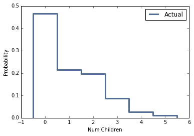
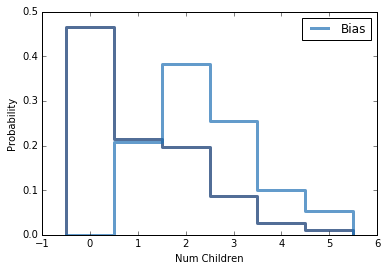

[Think Stats Chapter 3 Exercise 1](http://greenteapress.com/thinkstats2/html/thinkstats2004.html#toc31) (actual vs. biased)

>> **Exercise 3.1** Something like the class size paradox appears if you survey children and ask how many children are in their family. Families with many children are more likely to appear in your sample, and families with no children have no chance to be in the sample.  
Use the NSFG respondent variable NUMKDHH to construct the actual distribution for the number of children under 18 in the household.  
Now compute the biased distribution we would see if we surveyed the children and asked them how many children under 18 (including themselves) are in their household.
Plot the actual and biased distributions, and compute their means. As a starting place, you can use chap03ex.ipynb.

**Solution**

The exercise aims to examine the consequences of biased data by using data on the number of children under 18 in the household of respondents. First, the actual distribution of the number of children will be constructed as such:

```python
# Import Relevant Libraries
from chap01soln import ReadFemResp
import thinkstats2
import thinkplot
%matplotlib inline
```

```python
# Load Data
data = ReadFemResp()
data = data['numkdhh']

# Preview Data
data.head(n=10)
```

    0    3
    1    0
    2    0
    3    0
    4    0
    5    0
    6    0
    7    0
    8    2
    9    0
    Name: numkdhh, dtype: int64

```python
# Create a Probability Mass Function
pmf = thinkstats2.Pmf(data)
```

```python
# Create a Plot of the Probability Mass Function
thinkplot.Pmf(pmf,label='Actual')
thinkplot.Config(xlabel='Num Children',ylabel='Probability')
thinkplot.Show()
```



The plot above illustrates that the most common number of children under 18 in the household is 0. Now, the biased distribution will be constructed such that each children in the sample will answer the number of children in their household.

```python
# An alterntaive approach to the method provided in the text
def BiasPmf_1(data,label):
    counts = thinkstats2.Hist(data)
    bias_counts = thinkstats2.Hist()
    for num in counts:
        bias_counts[num] = num*counts[num]
    bias_pmf = thinkstats2.Pmf(bias_counts,label=label)
    return bias_pmf

pmf_bias = BiasPmf_1(data,'Bias')
```

```python
# A similar approach to the method provided in the text
def BiasPmf_2(pmf,label):
    bias_pmf = pmf.Copy(label=label)
    for num, prob in pmf.Items():
        bias_pmf[num] = num*prob
    bias_pmf.Normalize()
    return bias_pmf

pmf_bias = BiasPmf_2(pmf,'Bias')
```

```python
# Plot the Actual & Biased Probability Mass Function
thinkplot.PrePlot(2)
thinkplot.Pmfs([pmf,pmf_bias])
thinkplot.Config(xlabel='Num Children',ylabel='Probability')
thinkplot.Show()
```


```python
# Compute the Mean of the Two Distributions
print('Actual Distribution Mean:',pmf.Mean())
print('Biased Distribution Mean:',pmf_bias.Mean())
```

    Actual Distribution Mean: 1.02420515504
    Biased Distribution Mean: 2.40367910066

As illustrated by the two plots, the biased distribution reported a larger probability for households with more children in comparison to the actual distribution. The mean of the two distributions also reflect the same trend as the actual distribution has a mean of 1.02 children and the biased distribution has a mean of 2.40 children. This is because, families with more children inflate the count of number of children & families with no children have no chance to be in the sample.
